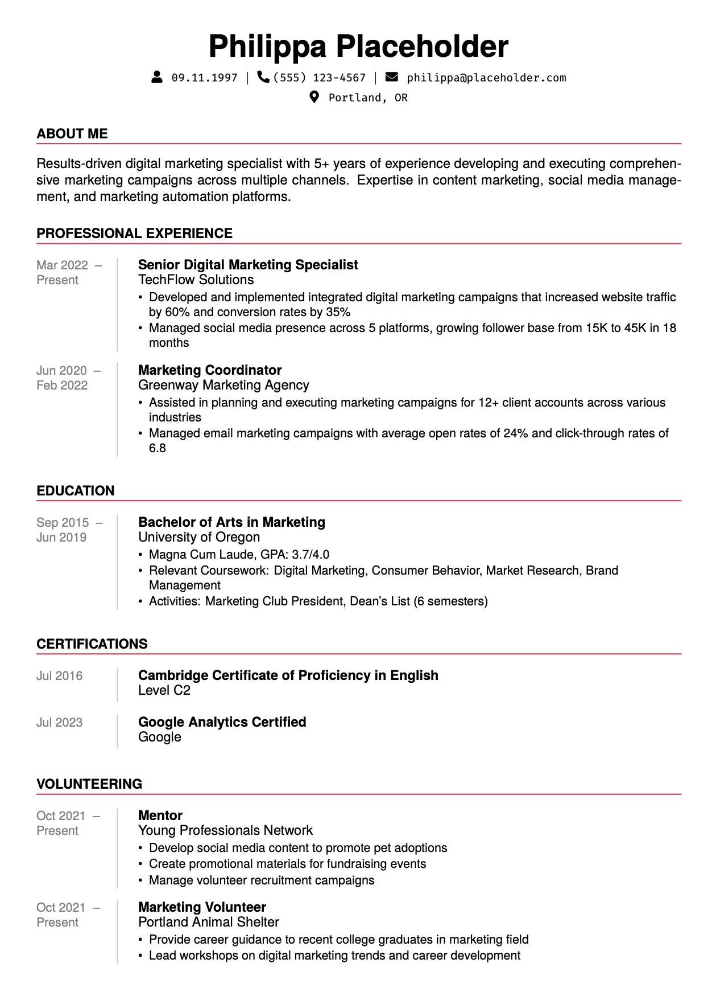

# pretty-resume

A minimal LaTeX template for creating visually appealing resumes and cover letters. Inspired by [harshibar's resume](https://github.com/harshibar/resume).



## Features

- Custom LaTeX class (`resumeclass.cls`) for consistent styling
- Modern fonts and color accents
- FontAwesome icons for contact information
- Sectioned layout for resume and letter
- Easy customization for personal details and formatting

## Customization

- Change accent colors in resumeclass.cls.
- Add or modify sections in resume.tex and letter.tex.

## Files

- `resumeclass.cls` – Custom LaTeX class for formatting
- `resume.tex` – Example resume document
- `letter.tex` – Example cover letter document

## Usage

1. Install a full LaTeX distribution (e.g., TeX Live).
2. Clone this repository.
3. Edit `resume.tex` and `letter.tex` with your information.
4. Compile with `pdflatex`:

   ```sh
   pdflatex resume.tex
   pdflatex letter.tex
   ````

5. Find the generated PDFs (resume.pdf, letter.pdf) in the project folder.
